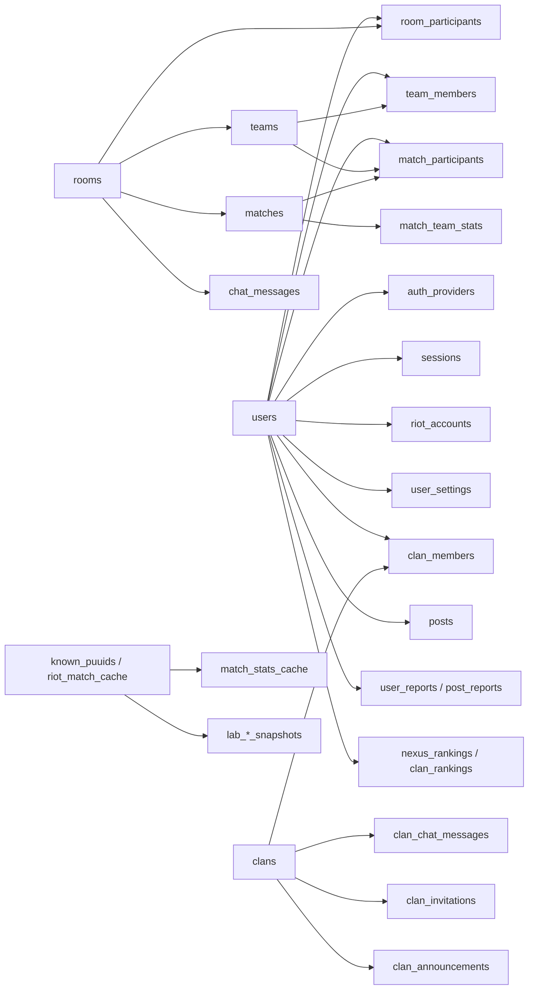

# Database Schema Analysis

작성일: 2026-04-27  
기준 파일: `packages/database/prisma/schema.prisma`

## 문서 상태

이 문서가 현재 DB 스키마의 최종 기준 문서다.

기존 `SCHEMA_UPDATES_NEEDED.md`는 과거에 필요한 스키마 변경 목록을 적어 둔 작업 문서였고, 현재 `schema.prisma`에는 해당 내용 대부분이 이미 반영되어 있다. 따라서 DB 구조 확인, 모델 관계 파악, 운영 리스크 검토는 이 문서를 기준으로 한다.

## 요약

이 프로젝트의 DB는 PostgreSQL을 사용하며 Prisma 스키마가 단일 기준이다. Prisma Client는 `packages/database` 패키지에서 생성되고, API 서버는 `@nexus/database`를 통해 접근한다.

- DB Provider: PostgreSQL
- ORM: Prisma
- 주요 도메인: 사용자/인증, Riot 계정, 토너먼트 룸, 팀 구성, 매치/전적, 클랜, 커뮤니티, 신고/제재, 알림, 랭킹, Riot 캐시, Lab 대시보드 캐시
- 모델 수: 50개
- Enum 수: 23개
- ID 전략: 대부분 `String @id @default(cuid())`, 일부 캐시성 테이블은 자연키 사용
- 물리 테이블명: 대부분 `@@map`으로 snake_case 테이블에 매핑

## 운영 구조

## 도메인별 테이블

### 1. 사용자/인증

| 모델 | 테이블 | 역할 | 주요 제약/인덱스 |
| --- | --- | --- | --- |
| `User` | `users` | 서비스 사용자 본체. 권한, 평판, 접속 상태, 제재 상태를 포함한다. | `email` unique, `email/reputation/createdAt/isBanned` index |
| `AuthProvider` | `auth_providers` | 이메일/구글/디스코드 등 외부 인증 연결 | `provider + providerId` unique, `userId` index |
| `TermsAgreement` | `terms_agreements` | 약관/개인정보/연령/마케팅 동의 이력 | `userId` index |
| `Session` | `sessions` | refresh token 기반 세션 | `refreshToken` unique, `userId/expiresAt` index |
| `UserSettings` | `user_settings` | 알림/공개 범위/테마/하이라이트 설정 | `userId` unique |
| `AdminAuditLog` | `admin_audit_logs` | 관리자 조치 감사 로그 | `adminId/action/createdAt` index |
| `Appeal` | `appeals` | 제재 이의제기 | `userId + status`, `status + createdAt` index |

특징:

- `User` 삭제 시 인증 제공자, 세션, 설정, Riot 계정, 참여 이력 등 다수 하위 데이터가 cascade 삭제된다.
- 관리자 감사 로그도 `adminId` 기준 cascade라, 관리자가 삭제되면 감사 로그가 함께 사라진다. 감사 보존이 중요하면 `onDelete: Restrict` 또는 익명화 전략 검토가 필요하다.
- `DirectMessage`는 sender/receiver가 nullable이고 cascade가 없다. 사용자 삭제 후에도 사용자명 기반 메시지 보존을 의도한 구조로 보인다.

### 2. Riot 계정/소환사 데이터

| 모델 | 테이블 | 역할 | 주요 제약/인덱스 |
| --- | --- | --- | --- |
| `RiotAccount` | `riot_accounts` | Nexus 사용자와 Riot 계정 연결 | `puuid` unique, `gameName + tagLine` unique |
| `ChampionPreference` | `champion_preferences` | Riot 계정별 포지션/챔피언 선호도 | `riotAccountId + role + championId` unique |
| `SummonerSeasonTier` | `summoner_season_tiers` | PUUID별 시즌 티어 기록 | `puuid + season` unique |
| `KnownPuuid` | `known_puuids` | Riot 매치 수집 대상 PUUID 큐/커서 | `puuid` primary key, queue별 fetch cursor index |
| `RiotMatchCache` | `riot_match_cache` | Riot API 원본 매치 JSON 캐시 | `matchId` primary key, `queueId/gameEnd/patchVersion` index |

특징:

- `RiotAccount.puuid`와 `KnownPuuid.puuid`는 논리적으로 연결되지만 Prisma relation은 없다.
- `KnownPuuid`는 ranked/normal/aram/custom 각각의 fetch cursor를 분리해 증분 수집을 지원한다.
- `RiotMatchCache.data`는 `Json`으로 원본 데이터를 보관하며, `Match`/`MatchParticipant`는 분석용 정규화 데이터로 사용된다.

### 3. 룸/팀 구성

| 모델 | 테이블 | 역할 | 주요 제약/인덱스 |
| --- | --- | --- | --- |
| `Room` | `rooms` | 토너먼트/내전 방 | `hostId/status/isPrivate/createdAt` index |
| `RoomParticipant` | `room_participants` | 방 참여자/관전자/준비 상태/팀 배정 | `roomId + userId` unique |
| `RoomDiscordChannel` | `room_discord_channels` | 방별 디스코드 음성/텍스트 채널 | `channelId` unique |
| `Team` | `teams` | 방 내부 팀 및 예산 상태 | `roomId/captainId` index |
| `TeamMember` | `team_members` | 팀원, 배정 포지션, 낙찰가, 픽 순서 | `teamId + userId` unique |
| `SnakeDraftPick` | `snake_draft_picks` | 스네이크 드래프트 픽 기록 | `roomId/teamId` index |
| `AuctionBid` | `auction_bids` | 경매 모드 입찰 기록 | `roomId + createdAt`, `targetUserId + createdAt` index |
| `ChatMessage` | `chat_messages` | 방 채팅 또는 roomName 기반 채팅 | `roomId + createdAt`, `roomName` index |

특징:

- `Room`은 `TeamMode`로 `SNAKE_DRAFT`와 `AUCTION`을 모두 지원한다.
- `Room.bracketFormat`의 기본값은 `SINGLE_ELIMINATION`인데, `BracketType`에는 `SINGLE`도 함께 존재한다. 두 값의 의미 차이를 코드 레벨에서 명확히 유지해야 한다.
- `RoomParticipant.teamId`는 nullable이라 참가자가 아직 팀에 배정되지 않은 상태를 표현할 수 있다.
- `AuctionBid.targetUserId`는 `User` relation이 없다. 삭제/무결성 보장이 필요하면 relation 추가를 검토할 수 있다.

### 4. 매치/전적

| 모델 | 테이블 | 역할 | 주요 제약/인덱스 |
| --- | --- | --- | --- |
| `Match` | `matches` | Nexus 내부 매치와 외부 Riot 매치 공통 헤더 | `roomId/teamAId/teamBId/status` index |
| `MatchParticipant` | `match_participants` | 매치 참가자별 챔피언/아이템/KDA/오브젝트/룬 지표 | `matchId + puuid` unique |
| `MatchTeamStats` | `match_team_stats` | 팀 단위 오브젝트/밴/승패 지표 | `matchId + teamId` unique |
| `MatchStatsCache` | `match_stats_cache` | 사용자별 queue/season 통계 캐시 | `userId + queueGroup + season` unique |
| `StatsRecomputeQueue` | `stats_recompute_queue` | 통계 재계산 대기 큐 | `userId` primary key |

특징:

- `Match.roomId`, `teamAId`, `teamBId`, `winnerId`는 nullable이다. 외부 랭크 매치 캐시를 같은 테이블에 적재하기 위한 설계다.
- `MatchParticipant.userId/teamId`도 nullable이다. Nexus 사용자로 매핑되지 않는 PUUID와 Riot 팀 번호(`riotTeamId`)를 저장할 수 있다.
- `MatchParticipant`에는 고정 컬럼이 많고 조회 빈도가 높을 가능성이 크다. 챔피언/PUUID/매치 기준 index는 있으나, `position`, `win`, `createdAt` 기반 분석 조회가 늘어나면 추가 인덱스가 필요할 수 있다.
- `perks`, `bans`, `stats`, `recentGames`는 JSON 필드다. JSON 내부 조건 검색이 많아지면 PostgreSQL GIN index 또는 별도 정규화 테이블을 검토해야 한다.

### 5. 클랜

| 모델 | 테이블 | 역할 | 주요 제약/인덱스 |
| --- | --- | --- | --- |
| `Clan` | `clans` | 클랜 본체, 모집/권한/설정 | `name/tag` unique, `ownerId/isRecruiting` index |
| `ClanMember` | `clan_members` | 클랜 멤버와 역할 | `clanId + userId` unique |
| `ClanChatMessage` | `clan_chat_messages` | 클랜 채팅 | `clanId + createdAt` index |
| `ClanInvitation` | `clan_invitations` | 초대/가입 요청 | `inviteCode` unique, `clanId + inviteeId + type + status` unique |
| `ClanAnnouncement` | `clan_announcements` | 클랜 공지 | `clanId + isPinned + createdAt` index |
| `ClanActivityLog` | `clan_activity_logs` | 클랜 활동 로그 | `clanId + createdAt` index |
| `ClanRanking` | `clan_rankings` | 클랜 내 사용자 랭킹 | `userId + clanId` unique |

특징:

- `Clan`에는 officer 권한 플래그가 있어 운영 권한을 세분화한다.
- `ClanInvitation`은 같은 클랜/대상/유형/상태의 중복 요청을 막는다. 다만 `inviteeId`가 nullable이라 공개 초대 코드와 사용자 지정 초대가 같은 테이블에 공존한다.
- 클랜 삭제 시 멤버, 채팅, 초대, 공지, 활동 로그, 랭킹이 cascade 삭제된다.

### 6. 커뮤니티/신고/평판

| 모델 | 테이블 | 역할 | 주요 제약/인덱스 |
| --- | --- | --- | --- |
| `Post` | `posts` | 커뮤니티 게시글 | `category + isPinned + createdAt`, `authorId` index |
| `Tag` | `tags` | 게시글 태그 | `name` unique |
| `PostTag` | `post_tags` | 게시글-태그 N:M 조인 | composite primary key |
| `Comment` | `comments` | 댓글/대댓글 | `postId + createdAt`, `parentId` index |
| `PostLike` | `post_likes` | 게시글 좋아요 | `userId + postId` unique |
| `CommentLike` | `comment_likes` | 댓글 좋아요 | `userId + commentId` unique |
| `PostBookmark` | `post_bookmarks` | 게시글 북마크 | `userId + postId` unique |
| `PostReport` | `post_reports` | 게시글/댓글 신고 | `status + createdAt`, `reporterId` index |
| `UserRating` | `user_ratings` | 매치 후 사용자 평가 | `reporterId + targetUserId + matchId` unique |
| `UserReport` | `user_reports` | 사용자 신고 | `targetUserId + status + createdAt`, `status` index |
| `Friendship` | `friendships` | 친구/차단 관계 | `userId + friendId` unique |
| `Notification` | `notifications` | 사용자 알림 | `userId + isRead + createdAt` index |
| `DirectMessage` | `direct_messages` | 1:1 메시지 | `senderId + receiverId + createdAt`, `receiverId + isRead` index |

특징:

- 게시글과 댓글은 soft delete 필드(`isDeleted`, `deletedAt`, `deletedBy`)와 blind 처리 필드(`isBlinded`)를 갖는다.
- 좋아요/북마크는 unique 제약으로 중복 액션을 방지한다.
- 신고 테이블은 게시글/댓글 신고(`PostReport`)와 사용자 신고(`UserReport`)가 분리되어 있다.
- `PostReport`는 `postId`와 `commentId`가 둘 다 nullable이다. DB 레벨에서 "둘 중 하나만 필수" 제약은 없다.

### 7. 랭킹

| 모델 | 테이블 | 역할 | 주요 제약/인덱스 |
| --- | --- | --- | --- |
| `NexusRanking` | `nexus_rankings` | 전체 Nexus 사용자 랭킹 | `userId` unique, `globalRank/winRate` index |
| `ClanRanking` | `clan_rankings` | 클랜별 사용자 랭킹 | `userId + clanId` unique, `clanId + clanRank` index |

특징:

- 랭킹은 원본 매치 데이터에서 계산된 denormalized projection이다.
- `updatedAt @updatedAt`만 있고 `createdAt`은 없다. 히스토리 분석이 필요하면 랭킹 스냅샷 테이블이 별도로 필요하다.

### 8. Lab 대시보드 캐시

| 모델 | 테이블 | 역할 | 주요 제약/인덱스 |
| --- | --- | --- | --- |
| `LabChampionSnapshot` | `lab_champion_snapshots` | 기간/패치/챔피언/포지션별 커스텀 매치 집계 | `period + patchVersion + championId + position` unique |
| `LabSynergySnapshot` | `lab_synergy_snapshots` | 챔피언 2인 조합 시너지 | `period + champ1Id + champ2Id` unique |
| `LabRankedChampionSnapshot` | `lab_ranked_champion_snapshots` | 외부 고티어 랭크 기반 챔피언 메타 | `period + patchVersion + championId + position` unique |
| `LabCounterSnapshot` | `lab_counter_snapshots` | 챔피언 상성 집계 | `period + champId + vsChampId + position` unique |

특징:

- Lab 테이블은 원본 매치 데이터에서 계산된 읽기 최적화 캐시다.
- Wilson score 하한(`wilsonLower`)을 정렬 기준으로 저장한다.
- `position`은 nullable이다. Prisma/PostgreSQL에서 unique index 내 NULL은 중복으로 취급되지 않으므로, `position = null`인 전체 포지션 행의 중복 방지가 의도대로 동작하는지 확인이 필요하다. PostgreSQL 15 이상의 `NULLS NOT DISTINCT` 또는 sentinel 값 사용을 검토할 수 있다.

## 주요 관계

### 사용자 중심 관계

- `User 1:N RiotAccount`
- `User 1:1 UserSettings`
- `User 1:N Session`
- `User 1:N RoomParticipant`
- `User 1:N TeamMember`
- `User 1:N MatchParticipant`
- `User 1:N ClanMember`
- `User 1:N Post/Comment/PostLike/CommentLike/PostBookmark`
- `User 1:N Notification`
- `User 1:1 NexusRanking`
- `User N:M User`는 `Friendship`의 `userId/friendId` 자기 참조로 표현한다.

### 룸/매치 관계

- `Room 1:N RoomParticipant`
- `Room 1:N Team`
- `Room 1:N Match`
- `Team 1:N TeamMember`
- `Team 1:N MatchParticipant`
- `Match 1:N MatchParticipant`
- `Match 1:N MatchTeamStats`
- `Match N:1 Team`은 `teamA/teamB/winner` 관계로도 연결된다.

### 클랜 관계

- `Clan 1:N ClanMember`
- `Clan 1:N ClanInvitation`
- `Clan 1:N ClanAnnouncement`
- `Clan 1:N ClanActivityLog`
- `Clan 1:N ClanRanking`

### 커뮤니티 관계

- `Post 1:N Comment`
- `Post N:M Tag` via `PostTag`
- `Comment 1:N Comment` via `parent/replies`
- `Post/Comment 1:N PostReport`

## 삭제 정책 분석

Cascade가 적극적으로 사용된다.

| 부모 | Cascade 대상 예시 | 영향 |
| --- | --- | --- |
| `User` | 세션, 인증 제공자, Riot 계정, 댓글/게시글, 신고/평가, 알림 등 | 사용자 삭제 시 서비스 활동 데이터가 광범위하게 삭제됨 |
| `Room` | 참가자, 팀, 매치, 디스코드 채널, 드래프트 픽 | 방 삭제 시 토너먼트 구조와 매치가 함께 삭제됨 |
| `Team` | 팀원, 입찰, 매치 참가자, 팀 스탯 | 팀 삭제 시 팀 기반 기록 삭제 |
| `Match` | 참가자, 팀 스탯, 평가, 신고 | 매치 삭제 시 분석/평가 근거 삭제 |
| `Clan` | 멤버, 채팅, 초대, 공지, 활동 로그, 랭킹 | 클랜 삭제 시 클랜 활동 기록 삭제 |
| `Post` | 댓글, 좋아요, 북마크, 태그 연결 | 게시글 삭제 시 커뮤니티 반응 삭제 |

주의할 점:

- 감사/신고/랭킹처럼 운영 근거가 되는 데이터도 cascade 대상이 많다.
- 실제 서비스에서 법적/운영 보존이 필요하면 hard delete 대신 soft delete, 익명화, 보존 테이블 분리 전략이 필요하다.

## 인덱스/성능 관찰

잘 잡혀 있는 부분:

- 방 목록/상태 조회: `Room.status`, `Room.isPrivate`, `Room.createdAt`
- 방 참가자 상태 체크: `RoomParticipant(roomId, isReady, role)`
- 채팅 조회: `ChatMessage(roomId, createdAt)`, `ClanChatMessage(clanId, createdAt)`
- 매치 참가자 조회: `MatchParticipant(matchId/userId/teamId/championId/puuid)`
- 친구/알림: `Friendship(userId, status)`, `Notification(userId, isRead, createdAt)`
- Riot 수집 큐: `KnownPuuid(priority, *_FetchedAt)`
- Lab 랭킹성 조회: `period + position + wilsonLower`

추가 검토 후보:

- `MatchParticipant(position, championId, win)` 또는 `championId + position + createdAt`: 챔피언 통계/랩 집계가 DB에서 자주 계산된다면 유용할 수 있다.
- `Match(riotMatchId)`: Riot match id로 매치 헤더를 찾는 코드가 있다면 unique 또는 index가 필요하다.
- `Match(patchVersion)`: 패치별 분석이 증가하면 필요하다.
- `Post(isDeleted, category, createdAt)`: 삭제 제외 목록 조회가 많다면 현재 index보다 실제 WHERE 조건에 맞춘 복합 index가 필요할 수 있다.
- JSON 필드 GIN index: `RiotMatchCache.data`, `MatchParticipant.perks`, `MatchTeamStats.bans`, `MatchStatsCache.stats/recentGames` 내부 조건 검색이 생길 때 검토한다.

## 무결성/리스크

1. `BracketType` 값 중 `SINGLE`과 `SINGLE_ELIMINATION`이 공존한다.
   - `Room.bracketFormat` 기본값은 `SINGLE_ELIMINATION`이다.
   - 기존 코드나 마이그레이션에서 `SINGLE`을 쓰는지 확인하고 의미를 통합하는 편이 좋다.

2. nullable 컬럼이 포함된 unique 제약이 기대와 다르게 동작할 수 있다.
   - Lab snapshot의 `position` nullable unique
   - `ClanInvitation(clanId, inviteeId, type, status)`의 `inviteeId` nullable
   - PostgreSQL은 일반 unique index에서 NULL끼리 중복으로 보지 않는다.

3. 일부 외래키가 논리 관계만 있고 DB relation은 없다.
   - `AuctionBid.targetUserId`
   - `KnownPuuid.puuid`와 `RiotAccount.puuid`
   - `RiotMatchCache.matchId`와 `Match.riotMatchId`
   - 수집/캐시 성격이라 의도적일 수 있으나, 무결성보다 적재 유연성을 택한 구조다.

4. `PostReport`는 `postId`와 `commentId`가 모두 nullable이다.
   - DB 레벨에서 신고 대상 필수 조건이 없다.
   - 서비스 레이어 validation이 반드시 필요하다.

5. 감사 로그가 사용자 cascade에 묶여 있다.
   - `AdminAuditLog.adminId`가 cascade라 관리자 계정 삭제 시 감사 로그도 삭제된다.
   - 운영 감사가 중요하면 계정 삭제 정책과 함께 재검토해야 한다.

6. 스키마 변경 방식이 혼재되어 보인다.
   - 문서에는 `db push` 선호가 언급되어 있고, 실제 migrations는 3개만 존재한다.
   - 운영 DB에서는 마이그레이션 이력과 실제 스키마 drift 관리 방식을 명확히 해야 한다.

## 마이그레이션 현황

현재 `packages/database/prisma/migrations`에는 다음 migration 파일만 있다.

- `20260214_add_rooms_bracket_format`
- `20260415_add_clan_officer_permissions`
- `20260417_add_match_stats_recent_games`

스키마 전체 규모에 비해 migration 수가 적다. 개발 중 `prisma db push`를 주로 사용한 것으로 보이며, 운영 환경에서 재현 가능한 schema migration history가 필요한 경우에는 baseline migration 생성과 drift 점검 절차가 필요하다.

## 권장 작업

우선순위 높음:

- `BracketType`의 `SINGLE` vs `SINGLE_ELIMINATION` 사용처 정리
- nullable unique 제약이 의도대로 중복을 막는지 테스트
- `PostReport` 대상 필수 조건을 DB check constraint 또는 서비스 validation으로 보강
- 운영 보존 대상 데이터의 cascade 정책 검토

우선순위 중간:

- Riot match id 조회가 있으면 `Match.riotMatchId` index/unique 검토
- Lab/통계 쿼리 실제 실행계획 기준으로 `MatchParticipant` 복합 인덱스 추가 검토
- JSON 내부 검색이 생긴 필드에 GIN index 적용 여부 검토
- migration baseline과 `db push`/`migrate deploy` 운영 정책 정리

우선순위 낮음:

- `createdAt`이 없는 projection 테이블에 생성 시각 필요 여부 검토
- 논리 FK만 존재하는 캐시 테이블 관계를 문서화하거나 명시적 relation으로 전환
- soft delete 대상 조회 조건에 맞춘 복합 index 튜닝
