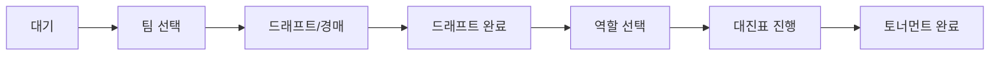
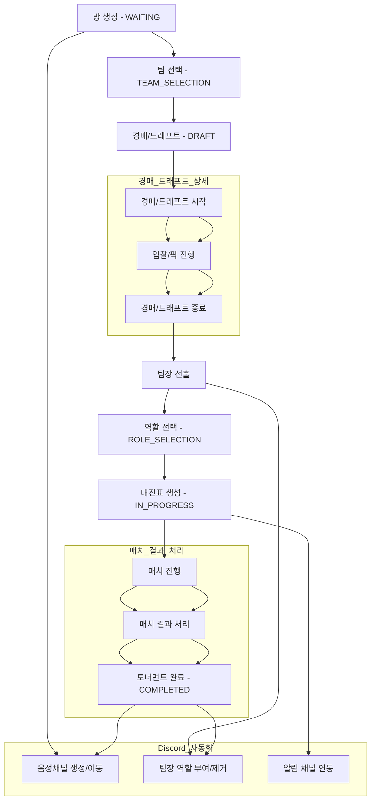
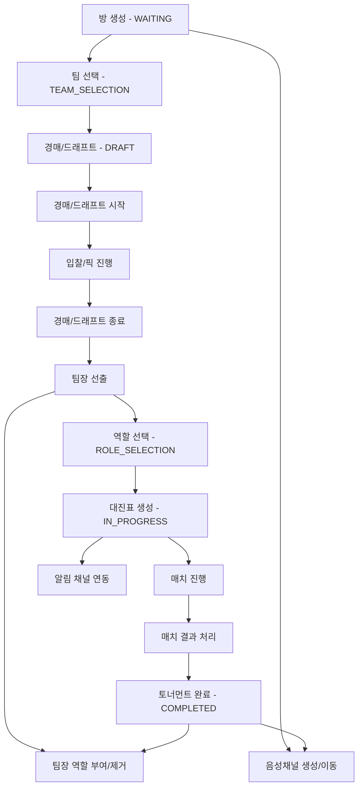

# 내전 관련 코드 개선점 분석
---
## 🖼️ 내전/토너먼트 단계별 흐름 다이어그램



### 경매/드래프트 내부 로직 및 매치 결과 처리 상세 다이어그램



---

## 📋 개요

내전(Match/Tournament) 관련 코드를 분석하여 발견된 개선점을 정리한 문서입니다.

---

## 🔴 주요 문제점
### 1. **match.service.ts - 파일 복잡도가 너무 높음**

- 파일이 1452줄로 너무 길고 복잡함
- 단일 책임 원칙(SRP) 위반
- 유지보수 및 테스트 어려움

**개선 방안:**

```typescript
// 파일 분리 제안:
-match -
  bracket.service.ts - // 브래킷 생성 로직
  match -
  advancement.service.ts - // 승자 진출 로직
  match -
  riot.service.ts - // Riot API 통합
  match -
  notification.service.ts; // 알림 처리
```

### 2. **Double Elimination 로직의 복잡성**

- 4팀/8팀 케이스가 섞여 있어 확장성 부족

private async advanceDoubleElimination(...) {
case 'WB_R1': {
// ... 8개 이상의 케이스
}
}

````

**개선 방안:**
// 브래킷 구조를 데이터로 정의
interface BracketStructure {
  sections: BracketSection[];
  routingRules: RoutingRule[];
}

// 라우팅 규칙을 선언적으로 정의
const DOUBLE_ELIM_4_TEAMS: BracketStructure = {
  sections: [
    { id: 'WB_R1', type: 'winners', round: 1, matchCount: 2 },
    { id: 'WB_F', type: 'winners', round: 2, matchCount: 1 },
    // ...
  ],
  routingRules: [
    {
      from: 'WB_R1',
      winner: { to: 'WB_F', position: 'auto' },
      loser: { to: 'LB_R1', position: 'auto' }
    },
    // ...
  ]
};

// 제네릭 라우팅 엔진 사용
private async advanceDoubleElimination(
  structure: BracketStructure,
  matchId: string,
  winnerId: string,
  loserId: string
) {
  const rule = structure.routingRules.find(r => r.from === match.bracketRound);
  // 자동 라우팅...
}
````

---

### 3. **TBD 매치 처리 문제**

**문제:**

- 빈 문자열(`''`)을 TBD로 사용
- `null`이 더 적절한데 타입 안정성 부족

**현재 코드:**

```typescript
// match.service.ts:235-238
matches.push({
  teamAId: "", // TBD - 빈 문자열 사용
  teamBId: "", // TBD
});
```

**개선 방안:**

```typescript
// null 사용 및 타입 명확화
matches.push({
  teamAId: null, // TBD
  teamBId: null, // TBD
});

// 타입 가드 추가
function isTBDMatch(match: Match): boolean {
  return match.teamAId === null || match.teamBId === null;
}
```

---

### 4. **트랜잭션 처리 부족**

**문제:**

- 여러 DB 작업이 원자적으로 처리되지 않음
- 브래킷 생성, 매치 업데이트 등이 실패 시 데이터 불일치 가능

**현재 코드:**

```typescript
// match.service.ts:121-136
await Promise.all(
  bracket.matches.map((match) =>
    this.prisma.match.create({...})
  ),
);
// 실패 시 일부만 생성될 수 있음
```

**개선 방안:**

```typescript
await this.prisma.$transaction(async (tx) => {
  // 모든 매치 생성
  const createdMatches = await Promise.all(
    bracket.matches.map((match) =>
      tx.match.create({...})
    )
  );

  // 룸 상태 업데이트
  await tx.room.update({
    where: { id: roomId },
    data: { status: RoomStatus.IN_PROGRESS },
  });

  return createdMatches;
});
```

---

### 5. **에러 처리 일관성 부족**

**문제:**

- 일부는 throw, 일부는 warn만 하고 계속 진행
- 사용자에게 명확한 에러 메시지 전달 부족

**개선 방안:**

- `generateMatchId()`가 타임스탬프 + 랜덤 기반
- 충돌 가능성 (비록 낮지만)
- Prisma의 `cuid()`를 사용하지 않음

**현재 코드:**

```typescript
// match.service.ts:1449-1451
private generateMatchId(): string {
  return `match_${Date.now()}_${Math.random().toString(36).substring(7)}`;
}
```

**개선 방안:**

```typescript
// Prisma의 cuid() 사용 (이미 DB에서 사용 중)
// 또는 UUID v4 사용
import { randomUUID } from 'crypto';

private generateMatchId(): string {
  return randomUUID(); // 또는 Prisma의 cuid() 사용
}

// 또는 DB에서 자동 생성되므로 제거 가능
```

---

### 7. **match-data-collection.service.ts - 재시도 로직**

**문제:**

- `setTimeout`을 사용한 비동기 재시도
- 메모리 누수 가능성 (서버 재시작 시)
- 작업 큐 관리 부재

**현재 코드:**

```typescript
// match-data-collection.service.ts:281-304
private async scheduleRetry(matchId: string, attemptNumber: number) {
  setTimeout(async () => {
    await this.collectMatchData(matchId);
  }, delayMs);
}
```

**개선 방안:**

```typescript
// BullMQ 또는 Bull 같은 작업 큐 사용
import { Queue } from "bullmq";

@Injectable()
export class MatchDataCollectionService {
  private readonly collectionQueue: Queue;

  async collectMatchData(matchId: string) {
    await this.collectionQueue.add("collect-match-data", {
      matchId,
      attempts: 5,
      backoff: {
        type: "exponential",
        delay: 60000,
      },
    });
  }
}

// 또는 Prisma의 스케줄러 사용
// 또는 cron job으로 주기적 재시도
```

---

### 8. **WebSocket 연결 관리**

**문제:**

- `match-store.ts`에서 소켓 연결이 제대로 정리되지 않을 수 있음
- 메모리 누수 가능성

**현재 코드:**

```typescript
// match-store.ts:197-282
connectToBracket: (roomId: string) => {
  const existingSocket = get().socket;
  if (existingSocket?.connected) {
    existingSocket.emit("leave-bracket", { roomId: get().roomId });
    existingSocket.disconnect();
  }
  // 새 소켓 생성...
};
```

**개선 방안:**

```typescript
// 소켓 정리 로직 강화
connectToBracket: (roomId: string) => {
  const existingSocket = get().socket;
  if (existingSocket) {
    // 모든 이벤트 리스너 제거
    existingSocket.removeAllListeners();
    existingSocket.disconnect();
  }

  const socket = io(...);

  // 컴포넌트 언마운트 시 정리 보장
  return () => {
    socket.removeAllListeners();
    socket.disconnect();
  };
}
```

---

### 9. **타입 불일치**

**문제:**

- `BracketView.tsx`와 `match-store.ts`의 Match 타입이 다름
- `teamA/teamB` vs `team1/team2` 불일치

**현재 코드:**

```typescript
// match-store.ts
interface Match {
  teamA?: Team;
  teamB?: Team;
}

// BracketView.tsx
interface Match {
  team1?: Team;
  team2?: Team;
}

// bracket/page.tsx:115-128
// 변환 로직이 필요함
const bracketMatches: Match[] = roomMatches.map((m) => ({
  team1: m.teamA ? {...} : undefined,
  team2: m.teamB ? {...} : undefined,
}));
```

**개선 방안:**

```typescript
// 공통 타입 정의 (packages/types/src/index.ts)
export interface Match {
  id: string;
  teamA?: Team;
  teamB?: Team;
  // ...
}

// 모든 곳에서 동일한 타입 사용
import { Match } from "@nexus/types";

// 변환 로직 제거
```

---

### 10. **성능 최적화**

**문제:**

- `getRoomMatches()`에서 불필요한 데이터 로드
- N+1 쿼리 문제 가능성

**현재 코드:**

```typescript
// match.service.ts:1050-1060
async getRoomMatches(roomId: string) {
  return this.prisma.match.findMany({
    where: { roomId },
    include: {
      teamA: true,
      teamB: true,
      winner: true,
    },
  });
}
```

**개선 방안:**

```typescript
// 필요한 필드만 선택
async getRoomMatches(roomId: string) {
  return this.prisma.match.findMany({
    where: { roomId },
    select: {
      id: true,
      round: true,
      matchNumber: true,
      status: true,
      bracketRound: true,
      teamA: {
        select: {
          id: true,
          name: true,
          color: true,
        },
      },
      teamB: {
        select: {
          id: true,
          name: true,
          color: true,
        },
      },
      winner: {
        select: {
          id: true,
          name: true,
        },
      },
    },
    orderBy: [{ round: "asc" }, { matchNumber: "asc" }],
  });
}
```

---

## 🟡 중간 우선순위 개선점

### 11. **로깅 개선**

**문제:**

- 일관성 없는 로그 레벨
- 민감한 정보 로깅 가능성

**개선 방안:**

```typescript
// 구조화된 로깅
this.logger.log({
  event: "bracket_generated",
  roomId,
  teamCount,
  bracketType: bracket.type,
  matchCount: bracket.matches.length,
});
```

---

### 12. **검증 로직 강화**

**문제:**

- 브래킷 생성 전 팀 구성 검증이 부족
- 매치 결과 보고 시 승자 검증이 단순함

**개선 방안:**

```typescript
// 검증 서비스 분리
@Injectable()
export class MatchValidationService {
  validateBracketGeneration(room: Room): void {
    // 팀 수 검증
    if (room.teams.length < 2) {
      throw new BadRequestException("최소 2팀이 필요합니다");
    }

    // 각 팀 인원 검증
    for (const team of room.teams) {
      if (team.members.length !== 5) {
        throw new BadRequestException(
          `팀 ${team.name}은 5명이어야 합니다 (현재: ${team.members.length}명)`,
        );
      }
    }

    // 중복 참가자 검증
    const allUserIds = room.teams.flatMap((t) =>
      t.members.map((m) => m.userId),
    );
    const uniqueUserIds = new Set(allUserIds);
    if (allUserIds.length !== uniqueUserIds.size) {
      throw new BadRequestException("중복 참가자가 있습니다");
    }
  }
}
```

---

### 13. **테스트 코드 부재**

**문제:**

- 복잡한 로직에 대한 테스트가 없음
- 특히 Double Elimination 로직 테스트 필요

**개선 방안:**

```typescript
// match.service.spec.ts
describe("MatchService", () => {
  describe("generateDoubleElimination4", () => {
    it("should generate correct bracket structure", () => {
      // 테스트 코드
    });
  });

  describe("advanceDoubleElimination", () => {
    it("should route winner to WB_F and loser to LB_R1", () => {
      // 테스트 코드
    });
  });
});
```

---

## 🟢 낮은 우선순위 개선점

### 14. **문서화**

- 복잡한 메서드에 JSDoc 추가
- 브래킷 타입별 동작 방식 문서화

### 15. **캐싱**

- 자주 조회되는 매치 정보 캐싱 (Redis)
- 브래킷 구조 캐싱

---

## 📊 우선순위 요약

| 우선순위 | 개선점                       | 예상 작업 시간 |
| -------- | ---------------------------- | -------------- |
| 🔴 높음  | 파일 분리 (match.service.ts) | 8-12시간       |
| 🔴 높음  | 트랜잭션 처리 추가           | 4-6시간        |
| 🔴 높음  | Double Elimination 리팩토링  | 12-16시간      |
| 🟡 중간  | 타입 통일                    | 2-4시간        |
| 🟡 중간  | 에러 처리 개선               | 4-6시간        |
| 🟡 중간  | 재시도 로직 개선             | 4-6시간        |
| 🟢 낮음  | 테스트 코드 작성             | 8-12시간       |
| 🟢 낮음  | 문서화                       | 2-4시간        |

---

## 🎯 즉시 적용 가능한 개선사항

1. **TBD 매치 처리**: 빈 문자열 → null 변경
2. **매치 ID 생성**: UUID 또는 Prisma cuid() 사용
3. **타입 통일**: 공통 타입 정의 및 사용
4. **로깅 개선**: 구조화된 로그 사용

---

## 📝 참고사항

- 모든 개선사항은 기존 기능을 유지하면서 점진적으로 적용 가능
- 테스트 코드 작성 후 리팩토링 진행 권장
- Double Elimination 리팩토링은 가장 복잡하므로 충분한 테스트 필요
