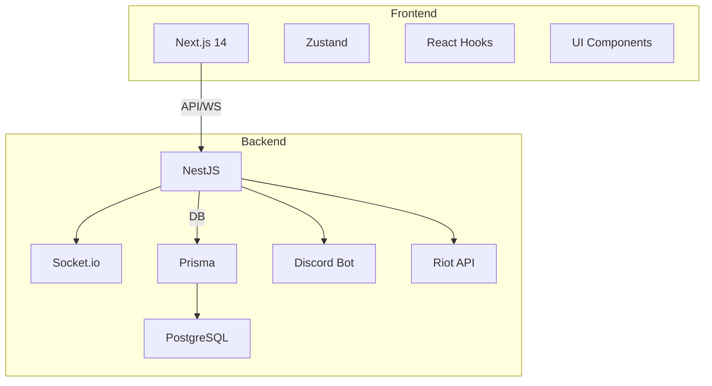
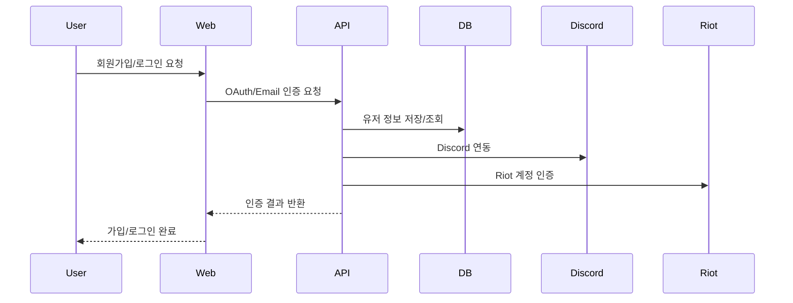
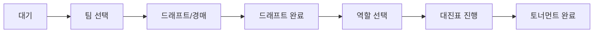
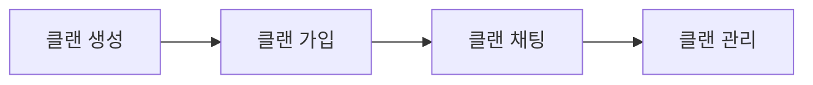

# Nexus 전체 서비스 다이어그램

> 프로젝트 전체 구조, 주요 도메인(유저 가입, 내전, 클랜 등)별 흐름을 시각적으로 정리한 문서입니다.

---

## 🏗️ 전체 아키텍처

---

## 👤 유저 가입/인증 흐름

---

## 🏆 내전/토너먼트 흐름

---

## 🏰 클랜/커뮤니티 흐름

---

## 🔗 기타 주요 도메인 흐름

- 친구 관리: 친구 요청 → 수락/차단 → 목록 관리
- 평판/신고: 신고 → 자동 밴/평판 점수 → 운영자 확인
- 커뮤니티: 게시글 작성 → 댓글/추천 → 신고/관리

---

> 각 도메인별 상세 다이어그램은 필요시 추가/보완 가능합니다.

**Last Updated**: 2026-02-23
