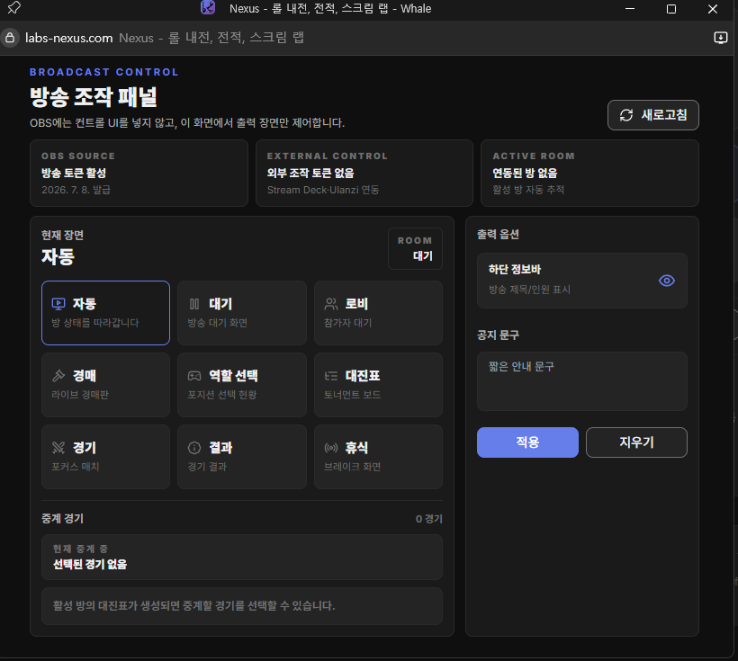
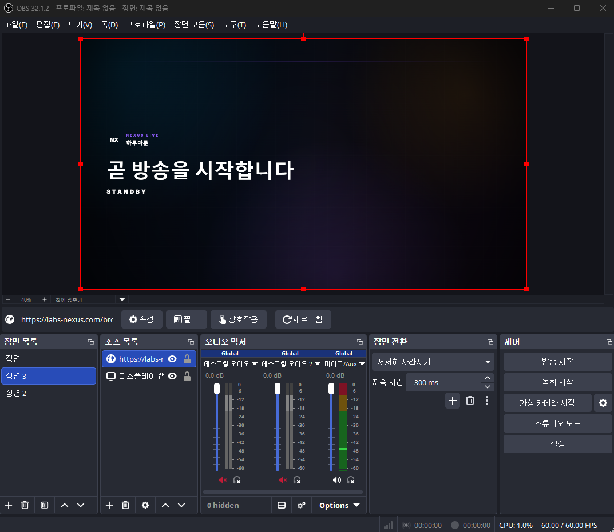

# NEXUS 6-7월 업데이트 노트

지난 한 달 동안 NEXUS는 내전 진행, 방송 송출, 프로필과 클랜 기능을 중심으로 여러 부분을 개선했습니다.

이번 업데이트의 방향은 분명합니다. 방장은 내전을 더 매끄럽게 운영하고, 참가자는 현재 상황을 더 쉽게 이해하고, 시청자는 방송 화면만 봐도 진행 흐름을 자연스럽게 따라갈 수 있도록 만드는 것입니다.

> 이미지 준비 안내  
> 아래 이미지 파일을 같은 경로에 넣으면 문서에서 바로 표시됩니다.
>
> - `docs/blog/images/2026-07-patch-notes/broadcast-control-panel.png`
> - `docs/blog/images/2026-07-patch-notes/obs-standby-overlay.png`
> - `docs/blog/images/2026-07-patch-notes/role-selection-overlay.png`
> - `docs/blog/images/2026-07-patch-notes/bracket-overlay.png`
> - `docs/blog/images/2026-07-patch-notes/profile-and-clan.png`

## 방송 오버레이 추가

OBS에 넣어 사용할 수 있는 방송 오버레이가 추가되었습니다.

이제 진행 화면 전체를 억지로 캡처하지 않아도 됩니다. 방송용 링크를 OBS 브라우저 소스로 추가하면 대기 화면, 경매, 역할 선택, 대진표, 경기, 결과 화면이 방송에 맞는 형태로 출력됩니다.

방송 화면에는 컨트롤 UI가 보이지 않고, 시청자에게 필요한 장면만 깔끔하게 표시됩니다. 내전 진행자는 운영에 집중하고, 방송에는 정리된 화면만 내보낼 수 있습니다.

## 방송 조작 패널

방송 화면을 별도로 제어할 수 있는 방송 조작 패널이 추가되었습니다.

자동 모드를 켜두면 방 상태에 따라 화면이 자연스럽게 전환됩니다. 필요할 때는 대기, 로비, 경매, 역할 선택, 대진표, 경기, 결과, 휴식 화면을 직접 선택할 수도 있습니다.

하단 정보바 표시 여부와 짧은 공지 문구도 조작할 수 있습니다. 방송 중 안내 문구나 잠깐의 공지를 화면에 띄우기 쉬워졌습니다.

## 경기 전환 기능

방송 조작 패널에서 현재 중계할 경기를 직접 바꿀 수 있습니다.

각 경기는 `4강 · 경기 2`처럼 라운드와 경기 번호가 먼저 보이고, 아래에는 `팀 A vs 팀 B` 형식으로 매치업이 표시됩니다. 팀명이 길어져도 라운드 정보와 팀명이 서로 밀리지 않도록 분리했습니다.

선택된 경기는 `현재 중계 중`으로 표시되고, 다른 경기는 `경기 전환` 버튼으로 바로 바꿀 수 있습니다. 진행 중인 경기는 경기 화면으로, 종료된 경기는 결과 화면으로 전환됩니다.

## 자동 진행 흐름 개선

대진표, 경기 화면, 결과 화면 사이의 자동 전환 흐름을 개선했습니다.

경기가 시작되면 방송은 대진표를 잠깐 보여준 뒤 해당 경기 화면으로 넘어갑니다. 경기가 끝나면 결과 화면을 보여주고, 이후 다시 대진표로 돌아가 다음 흐름을 보여줍니다.

15-20명 규모처럼 경기가 많은 내전에서도 매번 수동으로 화면을 바꾸는 부담을 줄였습니다.

## 역할 선택 화면 개선

역할 선택 방송 화면이 팀별 슬롯 구조로 바뀌었습니다.

각 팀마다 `TOP / JGL / MID / ADC / SUP` 칸이 고정되어 있고, 선택된 플레이어가 해당 칸에 들어갑니다. 팀이 많아져도 전체 상황을 한 화면에서 더 쉽게 볼 수 있습니다.

참가자는 어느 팀의 어떤 포지션이 채워졌는지 빠르게 확인할 수 있고, 시청자는 현재 팀 구성을 직관적으로 이해할 수 있습니다.

## 대진표 화면 개선

방송용 대진표 화면이 더 보기 좋게 정리되었습니다.

싱글 엘리미네이션과 더블 엘리미네이션을 구분해서 표시하고, 현재 중계 중인 경기는 강조됩니다. 경기 종료 후 다음 경기로 이어지는 흐름도 대진표에서 더 자연스럽게 확인할 수 있습니다.

## 경매 방송 화면 개선

경매 진행 상황을 방송 화면에서 더 읽기 쉽게 다듬었습니다.

입찰, 유찰, 낙찰, 타이머 상태가 실시간으로 반영되고, 팀별 예산과 선수 배치가 방송용 화면에 맞게 정리됩니다. 경매 타이머와 팀 카드의 시인성도 개선했습니다.

## 프로필과 유저 카드 개선

프로필 화면과 유저 정보 카드가 더 풍부해졌습니다.

내전 기록, 랭크 정보, 선호 라인, 선호 챔피언, 평균 KDA, 챔피언 기록 등을 더 보기 좋게 정리했습니다. 클랜 태그와 스트리머 정보도 프로필에서 더 자연스럽게 확인할 수 있습니다.

프로필 배너 커스터마이징도 추가되어 개인 페이지를 조금 더 개성 있게 꾸밀 수 있습니다.

## 클랜 기능 강화

클랜 페이지가 더 클랜답게 바뀌었습니다.

클랜 로고, 배너, 대표 색상을 설정할 수 있고, 모집 포지션이나 최소 티어 같은 모집 정보를 보여줄 수 있습니다. 클랜 목록에서는 모집 중인 클랜을 더 쉽게 찾을 수 있도록 필터와 정렬을 개선했습니다.

클랜 상세 페이지도 설명, 영역, 멤버 정보가 정리되어 클랜의 분위기와 모집 조건을 더 분명하게 보여줍니다.

## 디스코드 연동 개선

내전 모집 알림과 방 생성 알림이 더 안정적으로 동작하도록 개선했습니다.

방 알림에는 참가자 정보가 더 잘 표시되고, 참가자 변경도 자연스럽게 반영됩니다. 봇이 없는 서버에서 방 생성이 어색하게 진행되지 않도록 처리도 보완했습니다.

## 화면과 사용성 개선

여러 화면의 작은 불편함도 함께 정리했습니다.

모바일에서 메뉴와 내용이 겹치는 문제를 줄이고, 헤더가 좁은 데스크톱 구간에서 찌그러지지 않도록 조정했습니다. 경매, 로비, 역할 선택, 방 목록, 배너 영역도 전반적으로 더 보기 편하게 다듬었습니다.

## 마무리

이번 업데이트는 특히 내전을 운영하고 방송하는 분들에게 체감이 큰 업데이트입니다.

OBS 오버레이와 방송 조작 패널을 사용하면 내전 진행 상황을 더 깔끔하게 보여줄 수 있습니다. 앞으로도 진행자는 더 편하게 운영하고, 참가자와 시청자는 더 이해하기 쉬운 방향으로 계속 개선하겠습니다.
