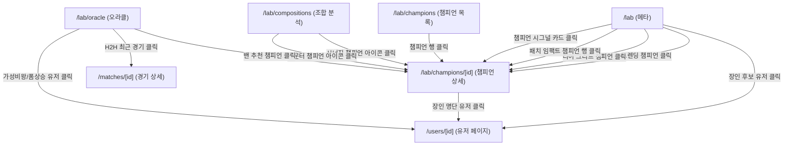

# Lab 워크플로우 다이어그램

> Task 0-1 결과물 (2026-04-24 합의)

## 노드 간 점프 화살표

## 트리거 상세

| 출발 위치 | 트리거 | 목적지 | 컨텍스트 |
|---|---|---|---|
| 메타 - 트렌딩 챔피언 아이콘/이름 | 클릭 | `/lab/champions/[id]?period=...` | 현재 기간 유지 |
| 메타 - 티어 그리드 챔피언 | 클릭 | `/lab/champions/[id]?period=...` | 현재 기간 유지 |
| 메타 - 패치 임팩트 챔피언 행 | 클릭 | `/lab/champions/[id]` | 기간 무관 |
| 메타 - 챔피언 시그널 카드 | 클릭 | `/lab/champions/[id]?period=...` | 현재 기간 유지 |
| 메타 - 장인 후보 유저 | 클릭 | `/users/[userId]` | - |
| 챔피언 목록 - 챔피언 행 | 클릭 | `/lab/champions/[id]?period=...&position=...` | 현재 필터 유지 |
| 챔피언 상세 - 장인 명단 유저 | 클릭 | `/users/[userId]` | - |
| 조합 - 시너지 카드 챔피언 아이콘 | 클릭 | `/lab/champions/[id]` | - |
| 조합 - 카운터 카드 챔피언 아이콘 | 클릭 | `/lab/champions/[id]` | - |
| 오라클 - 밴 추천 결과 챔피언 | 클릭 | `/lab/champions/[id]` | - |
| 오라클 - 가성비왕/고평가/폼상승 유저 | 클릭 | `/users/[userId]` | - |
| 오라클 - H2H 최근 경기 행 | 클릭 | `/matches/[matchId]` | - |

## 메타 탭 섹션 확정 (Task 0-2)

**Keep (6개)**
1. 트렌딩 챔피언 + 내전 vs 랭크 비교 (2-up 그리드)
2. 패치 임팩트 (브리핑+상세 통합, 1개 카드)
3. 포지션별 티어 그리드
4. 내전 활동 패턴
5. 챔피언 시그널 (연구 우선순위)
6. (장인 후보는 챔피언 상세 페이지로 이전 — 메타 탭에서 제거)

**제거**
- 패치 임팩트 "브리핑" 별도 카드 (상세에 통합)
- 패치 임팩트 포지션 변화 상세 / 조합 변화 상세 카드 (통합 카드 안으로)
- 라인 퍼포먼스 카드 (챔피언 탭으로)
- 아이템 트렌드 카드 (추후 별도 탭 또는 제거)
- 밴률 통계 카드 (조합 탭으로 이전)
- 장인 후보 / 시딩 장인 카드 (챔피언 상세 페이지로)
- "다음 단계 / 연구 질문 / 공개 조건" 메모 카드 3개 (삭제)
